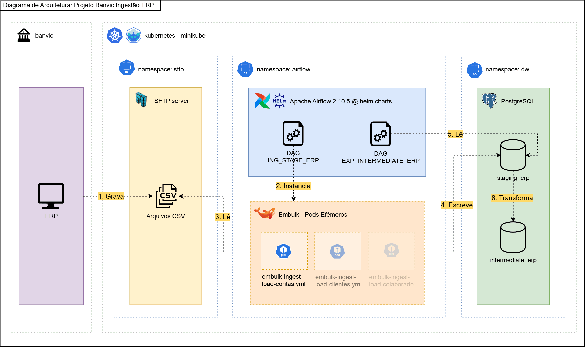

# 🏦 Desafio de Engenharia de Dados: BanVic S.A.

## 📌 Visão Geral

Este projeto foi desenvolvido como parte do desafio de certificação de Data Engineering. O objetivo é construir uma prova de conceito (POC) de infraestrutura e pipeline de ingestão de dados para o Banco Vitória S.A. (BanVic). O pipeline simula a extração de dados do ERP (arquivos CSV num servidor SFTP) e a sua ingestão em um Data Warehouse centralizado (PostgreSQL), para viabilizar análises comerciais e a criação de dashboards pela equipe de dados.

## 🏗️ Arquitetura



A solução foi arquitetada utilizando **Infraestrutura como Código (IaC)** e conteinerização orquestrada via **Kubernetes (Minikube)**.

- **Origem (Source):** Servidor SFTP simulando os sistemas legados/ERP.
- **Ingestão (ELT):** Embulk conteinerizado para extração e carga eficiente.
- **Destino (Target):** Banco de Dados PostgreSQL atuando como o Data Warehouse (DW).
- **Orquestração:** Apache Airflow executando DAGs para sequenciar e monitorar as tarefas de carga.

## 🗂️ Estrutura do Projeto

- `dags/`: Código das DAGs do Apache Airflow.
- `data/`: Arquivos CSV simulando os dados gerados pelo ERP do BanVic.
- `ingestion/`: Dockerfile e configurações (Taps/Targets) do Embulk.
- `k8s/`: Manifestos Kubernetes para Airflow, PostgreSQL e servidor SFTP.
- `public/`: Documentação, diagramas e instruções do desafio.

## 📊 Dados e Transformações

O pipeline de dados orquestrado pelo Apache Airflow é estruturado em duas etapas principais (DAGs), refletindo as boas práticas de extração, carga e transformação (ELT):

### 1. Ingestão (ING_STAGE_ERP)

Responsável por extrair os dados brutos (arquivos CSV) do servidor SFTP (simulando o ERP) e carregá-los de forma eficiente no schema de Staging do Data Warehouse PostgreSQL utilizando o Embulk.

**Entidades Ingeridas:**

- `agencias`
- `clientes`
- `colaboradores`
- `colaborador_agencia`
- `contas`
- `propostas_credito`
- `transacoes`

### 2. Transformação (EXP_INTERMEDIATE_ERP)

Após a carga na área de staging, esta DAG executa rotinas SQL para limpar e modelar os dados em um formato analítico, visando a construção de um modelo dimensional adequado para relatórios e dashboards comerciais.

**Modelagem Dimensional (Fatos e Dimensões):**

- **Dimensões:** `int_dim_agencias`, `int_dim_clientes`, `int_dim_colaboradores`
- **Fatos:** `int_fct_propostas_credito`, `int_fct_transacoes`
- **Tabelas de suporte/intermediárias:** `int_contas`, `int_colaborador_agencia`

### 3. Resultado Final do DW

```text
banvic_dw (Database)
└── Schemas
    ├── intermediate_erp
    │   └── Tables
    │       ├── int_brg_colaborador_agencia
    │       ├── int_dim_agencias
    │       ├── int_dim_clientes
    │       ├── int_dim_colaboradores
    │       ├── int_dim_contas
    │       ├── int_fct_contas
    │       ├── int_fct_propostas_credito
    │       └── int_fct_transacoes
    └── staging_erp
        └── Tables
            ├── stg_agencias
            ├── stg_clientes
            ├── stg_colaborador_agencia
            ├── stg_colaboradores
            ├── stg_contas
            ├── stg_propostas_credito
            └── stg_transacoes
```            

## ⚙️ Pré-requisitos

Certifique-se de ter as seguintes ferramentas instaladas localmente antes de prosseguir:

> ⚠️ **Importante**: Os comandos do README.md estão voltados para distribuições **Ubuntu**, portanto é fortemente recomendado usar Ubuntu ou [WSL](https://learn.microsoft.com/pt-br/windows/wsl/install) no Windows.

- [Docker](https://docs.docker.com/get-docker/)
- [Minikube](https://minikube.sigs.k8s.io/docs/start/)
- [Kubectl](https://kubernetes.io/docs/tasks/tools/)
- [Helm](https://helm.sh/docs/intro/install/)

---

## 🚀 Instalação e Configuração

Siga as etapas abaixo rigorosamente para provisionar o ambiente local.

### 1. Ambiente base

#### 1.1. Iniciar Minikube

Inicia o cluster Kubernetes local alocando os recursos necessários.

```bash
minikube start --cpus 6 --memory 8192

```

### 2. Configurar servidor SFTP (source)

O SFTP servirá como nossa origem de dados simulando o ERP.

#### 2.1. Configurar namespace e secrets

_Substitua "INSIRA_SENHA_SEGURA" por uma senha de sua preferência._

```bash
kubectl create namespace sftp

kubectl create secret generic sftp-credentials \\
  --from-literal=password=INSIRA_SENHA_SEGURA \\
  --from-literal=username=banvic_erp \\
  -n sftp

```

#### 2.2. Implantar servidor SFTP

```bash
kubectl apply -f ./k8s/sftp-server/sftp-server.yaml

```

#### 2.3. Copiar arquivos (Mock Data)

Copia os dados CSV locais para o servidor de origem.

```bash
kubectl cp ./data/ $(kubectl get pods -n sftp -l app=sftp-server -o jsonpath='{.items[0].metadata.name}'):/home/banvic_erp/upload -n sftp

```

### 3. Configurar banco PostgreSQL (target)

Este banco atuará como o Data Warehouse centralizado do BanVic.

#### 3.1. Configurar namespace e secrets

_Substitua "INSIRA_SENHA_SEGURA" por uma senha de sua preferência._

```bash
kubectl create namespace dw

kubectl create secret generic postgres-credentials \\
  --from-literal=password=INSIRA_SENHA_SEGURA \\
  --from-literal=username=banvic_dw_user \\
  --from-literal=dbname=banvic_dw \\
  -n dw

```

#### 3.2. Implantar PostgreSQL

```bash
kubectl apply -f k8s/postgres/

```

### 4. Configurar Airflow

Ferramenta responsável por orquestrar os pipelines de ingestão.

#### 4.1. Configurar namespace e secrets

_Substitua "INSIRA_SENHA_SEGURA" por uma senha de sua preferência._

```bash
kubectl create namespace airflow

kubectl create secret generic airflow-webserver-password \\
  --from-literal=password=INSIRA_SENHA_SEGURA \\
  -n airflow

```

#### 4.2. Implantar Airflow

Implantar via Helm chart (Versão airflow 2.10.5).

```bash
helm install airflow apache-airflow/airflow \\
  --version 1.16.0 \\
  -f k8s/airflow/values.yaml \\
  -n airflow

```

#### 4.3. Criar Connections

**4.3.1. Conexão com o Data Warehouse (PostgreSQL):**
_Substitua "INSIRA_SENHA_SEGURA" pela mesma senha definida na criação do secret do DW._

```bash
kubectl exec -it airflow-scheduler-0 -n airflow -- airflow connections add 'dw_postgres' \\
  --conn-type 'postgres' \\
  --conn-host 'postgres-target.dw.svc.cluster.local' \\
  --conn-login 'banvic_dw_user' \\
  --conn-password 'INSIRA_SENHA_SEGURA' \\
  --conn-schema 'banvic_dw' \\
  --conn-port '5432'

```

**4.3.2. Conexão com a Origem (SFTP):**
_Substitua "INSIRA_SENHA_SEGURA" pela mesma senha definida na criação do secret do SFTP._

```bash
kubectl exec -it airflow-scheduler-0 -n airflow -- airflow connections add 'sftp_erp' \\
  --conn-type 'sftp' \\
  --conn-host 'sftp-server.sftp.svc.cluster.local' \\
  --conn-login 'banvic_erp' \\
  --conn-password 'INSIRA_SENHA_SEGURA' \\
  --conn-port '22'

```

#### 4.4. Copiar DAGs

Em um ambiente produtivo utilizaria-se um _gitsync_, aqui realizamos a cópia manual para dentro do pod.

```bash
kubectl exec -it airflow-scheduler-0 -n airflow -- sh -c "rm -rf /opt/airflow/dags/*"
kubectl cp ./dags airflow-scheduler-0:/opt/airflow -n airflow

kubectl exec -it $(kubectl get pods -n airflow -l component=webserver -o jsonpath='{.items[0].metadata.name}') -n airflow -- sh -c "rm -rf /opt/airflow/dags/*"
kubectl cp ./dags $(kubectl get pods -n airflow -l component=webserver -o jsonpath='{.items[0].metadata.name}'):/opt/airflow -n airflow

kubectl exec -it airflow-scheduler-0 -n airflow -- airflow dags reserialize

```

### 5. Configurar o Embulk

Ferramenta para efetuar a extração nativa (bulk) e carregar os dados eficientemente no target.

#### 5.1. Gerar imagem do Embulk

Configura o Docker para usar o daemon do Minikube, para que a imagem fique disponível para o Kubernetes.

```bash
eval $(minikube docker-env)
docker build -t embulk-ingestion:latest ./ingestion

```

---

## 🌐 Acessando os Serviços

Execute os comandos abaixo para expor as portas dos serviços para a sua máquina hospedeira (localhost).

```bash
killall kubectl

# airflow (Acesse em http://localhost:8080)
kubectl port-forward svc/airflow-webserver 8080:8080 --namespace airflow > /dev/null 2>&1 &

# postgres target (Disponível na porta 5432 local)
kubectl port-forward svc/postgres-target 5432:5432 --namespace dw > /dev/null 2>&1 &

# sftp-server (Disponível na porta 2222 local)
kubectl port-forward svc/sftp-server 2222:22 --namespace sftp > /dev/null 2>&1 &

```

Agora use o link abaixo para acessar o Airflow:

> ✅ http://localhost:8080/
